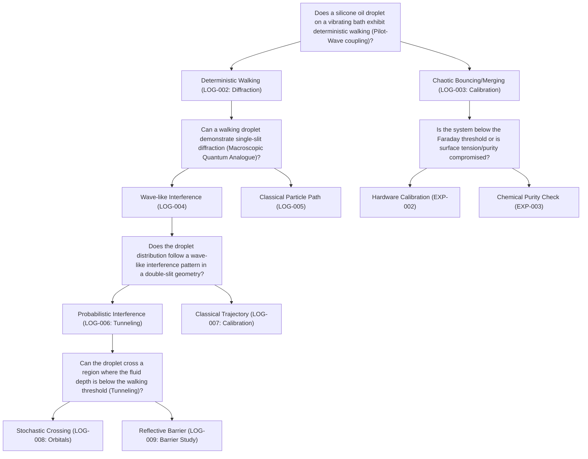

# Strategy Map

```mermaid
graph TD;
    LOG-001["Does a silicone oil droplet on a vibrating bath exhibit deterministic walking (Pilot-Wave coupling)?"];
    LOG-001_A["Deterministic Walking (LOG-002: Diffraction)"];
    LOG-001 --> LOG-001_A;
    LOG-001_A --> LOG-002;
    LOG-001_B["Chaotic Bouncing/Merging (LOG-003: Calibration)"];
    LOG-001 --> LOG-001_B;
    LOG-001_B --> LOG-003;
    LOG-002["Can a walking droplet demonstrate single-slit diffraction (Macroscopic Quantum Analogue)?"];
    LOG-002_A["Wave-like Interference (LOG-004)"];
    LOG-002 --> LOG-002_A;
    LOG-002_A --> LOG-004;
    LOG-002_B["Classical Particle Path (LOG-005)"];
    LOG-002 --> LOG-002_B;
    LOG-003["Is the system below the Faraday threshold or is surface tension/purity compromised?"];
    LOG-003_A["Hardware Calibration (EXP-002)"];
    LOG-003 --> LOG-003_A;
    LOG-003_B["Chemical Purity Check (EXP-003)"];
    LOG-003 --> LOG-003_B;
    LOG-004["Does the droplet distribution follow a wave-like interference pattern in a double-slit geometry?"];
    LOG-004_A["Probabilistic Interference (LOG-006: Tunneling)"];
    LOG-004 --> LOG-004_A;
    LOG-004_A --> LOG-006;
    LOG-004_B["Classical Trajectory (LOG-007: Calibration)"];
    LOG-004 --> LOG-004_B;
    LOG-006["Can the droplet cross a region where the fluid depth is below the walking threshold (Tunneling)?"];
    LOG-006_A["Stochastic Crossing (LOG-008: Orbitals)"];
    LOG-006 --> LOG-006_A;
    LOG-006_B["Reflective Barrier (LOG-009: Barrier Study)"];
    LOG-006 --> LOG-006_B;

```
