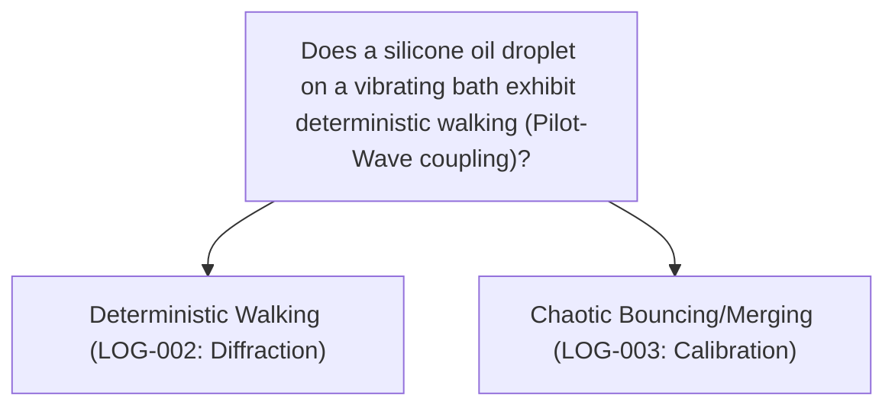

# Strategy Map

```mermaid
graph TD;
    LOG-001["Does a silicone oil droplet on a vibrating bath exhibit deterministic walking (Pilot-Wave coupling)?"];
    LOG-001_A["Deterministic Walking (LOG-002: Diffraction)"];
    LOG-001 --> LOG-001_A;
    LOG-001_B["Chaotic Bouncing/Merging (LOG-003: Calibration)"];
    LOG-001 --> LOG-001_B;

```
